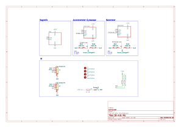
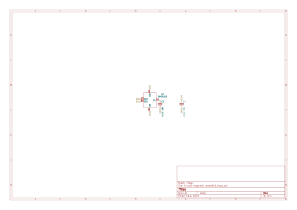
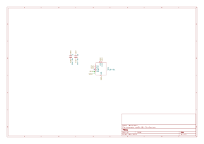

# 10 Axis IMU Datasheet

## Introduction

Version Code: O1252V10

The 10-axis IMU module integrates a 3-axis accelerometer sensor, 3-axis gyroscope sensor, 3-axis magnetometer sensor, and barometer. The module uses I2C communication and allows modification of I2C addresses for some chips. It has an onboard LED that indicates power status.

Main chips included in the module:
- SH3001 3-axis accelerometer and 3-axis gyroscope sensor
- QMC6310 3-axis magnetometer sensor
- SPL06-001 barometer

Specifications:
- Operating Voltage: 2.5-3.6V
- Operating Current: 4mA
- 3-axis accelerometer sensor
- 3-axis gyroscope sensor
- 3-axis magnetometer sensor
- Barometer
- I2C communication
- Modifiable I2C addresses for some chips
- Onboard LED for power status indication

## Pin Definition

The board contains two I2C interfaces, both SH1.0 4P structure, compatible with qwIIC, Stemma QT, Modulino and other interfaces. The two interfaces are parallel and can be used to extend to other I2C devices.

| Pin | Function |
| --- | --- |
| SCL | I2C Clock Line |
| SDA | I2C Data Line |
| VCC | Power Input, 2.5-3.6V |
| GND | Ground |

## Address Definition

### SH3001 I2C Address

The default address of SH3001 is 0x36, which can be switched to 0x37 by modifying the connection method.

The 3P pad jumper marked 0x3 on the left side of the board is the I2C address jumper for SH3001. It is connected to the left 6 by default, which is 0x36. You can cut the connection on the left, then use soldering iron to connect to the right 7 position to switch the address to 0x37.

### QMC6310 I2C Address

The address of QMC6310 is fixed at 0x1C or 0x3C, which varies according to different chips and cannot be manually switched.

### SPL06-001 I2C Address

The default address of SPL06-001 is 0x76, which can be switched to 0x77 by modifying the connection method.

The 3P pad jumper marked 0x7 on the right side of the board is the I2C address jumper for SPL06-001. It is connected to the left 6 by default, which is 0x76. You can cut the connection on the left, then use soldering iron to connect to the right 7 position to switch the address to 0x77.

## Parameters

### Electrical Parameters

| Parameter | Min | Typical | Max | Unit |
| ------- | :---: | :---: | :---: | :---: |
| Operating Voltage | 2.5 | 3.3 | 3.6 | V |
| Operating Current | | 4 | | mA |
| Operating Temperature | -40 | | 85 | °C |

### Performance Characteristics

### Gyroscope Characteristics
| Parameter | Condition | Value | Unit |
| --- | --- | :---: | :---: |
| Full Scale Range | Selectable via serial digital interface | ±125 ±250 ±500 ±1000 ±2000 | dps |
| Sensitivity | Selectable via serial digital interface | 262 131 65.5 32.8 16.4 | LSB/dps |
| Nonlinearity | Best fit straight line | ±0.2 | %FS |
| Cross-axis Sensitivity | | ±1 | % |
| Sensitivity Temperature Drift | -40°C - 85°C | ±0.02 | %/°C |
| Zero Rate Temperature Drift | -40°C - 85°C | ±0.05 | dps/°C |
| Zero Rate Offset | | ±5 | dps |
| Output Noise Density | | 10 | mdps/√Hz | 
| Output Data Rate | Selectable via serial digital interface | 31 63 125 250 500 1000 2000 4000 8000 16000 32000 | Hz |

### Accelerometer Characteristics
| Parameter | Condition | Value | Unit |
| --- | --- | :---: | :---: |
| Full Scale Range | Selectable via serial digital interface | ±2 ±4 ±8 ±16 | g |
| Sensitivity | Selectable via serial digital interface | 16384 8192 4096 2048 | LSB/g |
| Nonlinearity | Best fit straight line | ±0.5 | %FS |
| Cross-axis Sensitivity | | ±3 | % |
| Sensitivity Temperature Drift | -40°C - 85°C | ±0.01 | %/°C |
| Zero-g Temperature Drift | -40°C - 85°C | ±1 | mg/°C |
| Zero Offset | | ±50 | mg |
| Output Noise Density | | 220 | μg/√Hz |
| Output Data Rate | Selectable via serial digital interface | 16 31 63 125 250 500 1000 2000 4000 8000 | Hz |

### Magnetometer Characteristics
| Parameter | Condition | Value | Unit |
| --- | --- | :---: | :---: |
| Full Scale Range | Selectable via serial digital interface | ±2 ±8 ±12 ±30 | Gauss |
| Output Data Rate | Selectable via serial digital interface | 10 50 100 200 | Hz |
| Sensitivity | Field Range = ±30G | 1000 | LSB/G |
| Sensitivity | Field Range = ±12G | 2500 | LSB/G |
| Sensitivity | Field Range = ±8G | 3750 | LSB/G |
| Sensitivity | Field Range = ±2G | 15000 | LSB/G |
| Linearity | Field Range = ±30G HBM Range = ±15G | 0.5 | %FS |
| Hysteresis | 3 sweeps across ±30G | 0.03 | %FS |
| Offset | | ±10 | mG |
| Sensitivity Tempco | Ta = -40°C~85°C | ±0.05 | %/°C |
| Digital Resolution | Field Range = ±30G | 1.0 | mGauss |
| Field Resolution | Standard deviation, X/Y axis | 2 | mGauss |
| Field Resolution | Standard deviation, Z axis | 3 | mGauss |
| X-Y-Z Orthogonality | Sensitivity Directions | 90±1 | Degree |

### Barometer Characteristics
| Parameter | Condition | Min | Typical | Max | Unit |
| --- | --- | :---: | :---: | :---: | :---: |
| Relative Pressure Accuracy | 950...1050hPa +25...+40°C | -6 -0.5 | | 6 0.5 | Pa m |
| Absolute Pressure Accuracy | 300...1100hPa 0...+65°C | -1.0 | | 1.0 | hPa |
| Output Data Resolution | Pressure Temperature | | 0.06 0.01 | | Pa °C |
| Pressure Noise | Low Power Mode Standard Mode High Precision Mode | | 2 0.5 0.3 | 5 1.2 0.6 | PaRMS |
| Temperature Offset Coefficient | 1000hPa +25...+40°C | -0.5 -4.2 | ±0.2 ±1.7 | 0.5 4.2 | Pa/K cm/K |
| Absolute Temperature Accuracy | @+25°C 0...+65°C | -0.5 -1 | | 0.5 1 | °C |
| Pressure/Temperature Measurement Rate | | 1 | | 128 | Hz |
| Pressure Measurement Time | Low Power Mode Standard Mode High Precision Mode | | 5 28 105 | 8 35 115 | ms |

## Default XYZ Axis Directions

The XYZ axis directions are printed on the PCB silkscreen. The top of the PCB is the positive X-axis direction, the left side of the PCB is the positive Y-axis direction, and the vertical upward direction perpendicular to the PCB plane is the positive Z-axis direction.

## Reference Wiring Diagram

## Schematic Diagrams

### Main Schematic

### Accelerometer and Gyroscope Schematic

### Magnetometer Schematic

### Barometer Schematic

## Reference

[SH3001 datasheet](SH3001.pdf)
[QMC6310 datasheet](QMC6310.pdf)
[SPL06-001 datasheet](SPL06-001.pdf)